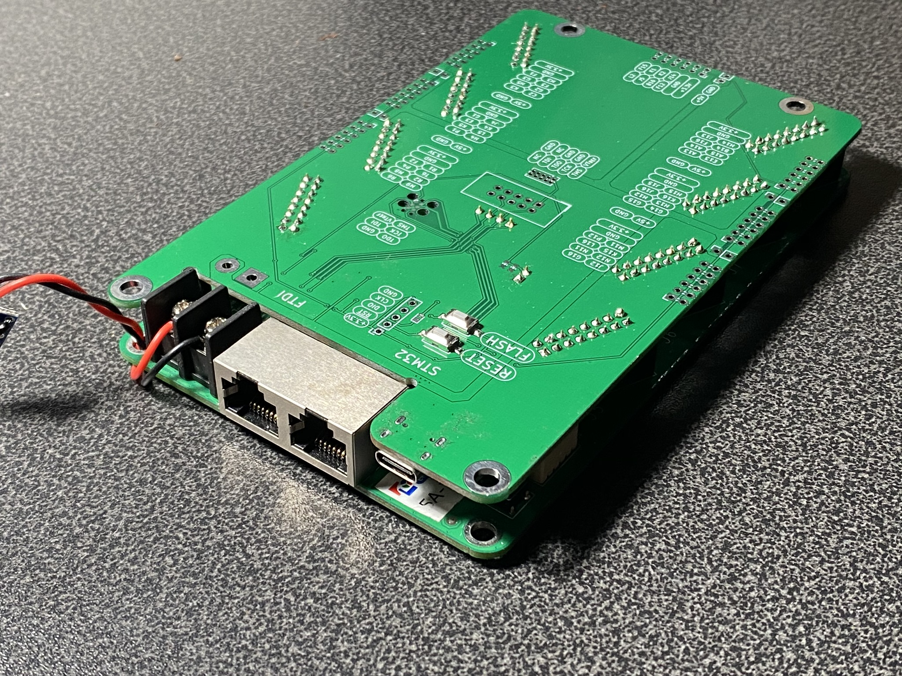

# Chubby Hat
A PCB that turns the Colorlight 5A-75B into an easy to use development platform for cheap.

## Features
* JTAG
  * USB to JTAG (STM32 or FTDI based)
  * alternatively 0.1", 0.05" and TC2030 header
* Breakout
  * 7 Pmod connectors
  * 5V headers

Read more on [ hackaday.io](https://hackaday.io/project/174032-chubby-hat).

## Renderings

### Top

### Bottom

