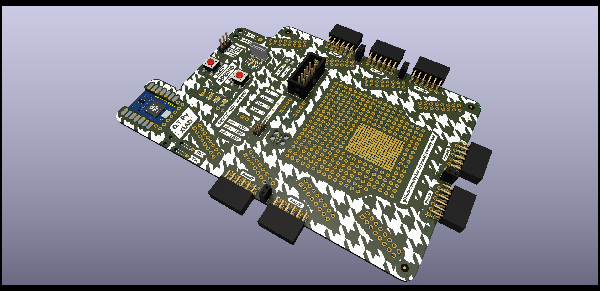

# Chubby Hat
A PCB that turns the [Colorlight 5A-75B](https://www.aliexpress.com/item/32728519290.html) into an easy to use development platform for cheap.
This project ist based on [q3k/chubby75](https://github.com/q3k/chubby75/tree/master/5a-75b).

Read more on [ hackaday.io](https://hackaday.io/project/174032-chubby-hat).

## Directory Structure
| directory  | content                                                              |
|------------|----------------------------------------------------------------------|
| source     | KiCad project directories                                            |
| production | fabrication files (Gerber, BOM, placement)                           |
| exports    | schematic and layout plots, board 3D model and renderings            |
| datasheets | component datasheets                                                 |
| assets     | board setups, component 3D models, logos                             |
| scripts    | BOM export plugins, miscellaneous helper scripts for file conversion |

### Version 0.1.0

- USB to JTAG via STM32 or FTDI
- two 3x Pmod ports


### Version 0.2.0


- USB to JTAG via extra dev board or on-board RP2040
- three 2x Pmod ports
  



## KiCad Version
```
Application: kicad-cli x86_64 on x86_64

Version: 7.0.0, release build

Libraries:
	wxWidgets 3.2.2
	FreeType 2.12.1
	HarfBuzz 6.0.0
	FontConfig 2.14.0
	libcurl/7.87.0 OpenSSL/3.0.8 zlib/1.2.13 brotli/1.0.9 zstd/1.5.2 libidn2/2.3.2 libssh2/1.10.0 nghttp2/1.51.0

Platform: , 64 bit, Little endian, wxBase, , wayland

Build Info:
	Date: Jan  1 1980 00:00:00
	wxWidgets: 3.2.2 (wchar_t,wx containers) GTK+ 0.0
	Boost: 1.79.0
	OCC: 7.6.2
	Curl: 7.87.0
	ngspice: 37
	Compiler: GCC 12.2.0 with C++ ABI 1017

Build settings:
	KICAD_USE_EGL=ON
	KICAD_SPICE=ON
```
